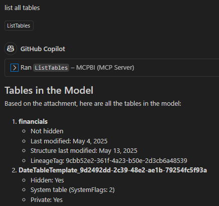

# Tabular MCP Server

This is a Model Context Protocol (MCP) server for locally running Tabular Models, i.e. PowerBI models running on PowerBI Desktop. 

This server allows any MCP-enabled LLM Client to communicate with your tabular models and help you debug, analyse and compose DAX queries. 

# How it works 

It connects to a local running instance of Tabular models using the [AdomdConnection in ADOMD.NET](https://learn.microsoft.com/en-us/analysis-services/adomd/multidimensional-models-adomd-net-client/connections-in-adomd-net?view=asallproducts-allversions). 

Using this connection, the server then allows clients to execute [DAX-queries](https://www.sqlbi.com/articles/execute-dax-queries-through-ole-db-and-adomd-net/) to retrieve model metadata (using [DAX INFO functions](https://learn.microsoft.com/en-us/dax/info-functions-dax)) through pre-defined and well documented tools for high accuracy, as well as custom EVALUATE queries for debugging and development.
This MCP server enables communication between clients and Power BI tabular models via ADOMD.NET, supporting both predefined DAX queries and custom EVALUATE statements.

## Tools

### ListMeasures
List all measures in the model, optionally filtered by table name
### GetMeasureDetails
Get details for a specific measure by name
### ListTables
List all tables in the model
### GetTableDetails
Get details for a specific table by name
### GetTableColumns
Get columns for a specific table by name
### GetTableRelationships
Get relationships for a specific table by name
### PreviewTableData
Preview data from a table (top N rows)
### EvaluateDAX
Evaluate a DAX expression, optionally limiting to top N rows

## How to install
See [`docs/Installation.md`](docs/Installation.md) for requirements and installation instructions.

## Testing
See ['resources/testing.md']

## Lincense 
MIT License or whatever 