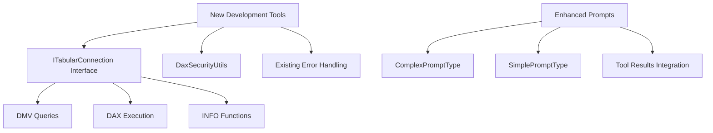

# Additional Tools Recommendations for Development & Debugging

**Date:** 2025-01-25  
**Focus Area:** Development and debugging tools enhancement  
**Current State:** Solid foundation with basic metadata tools and comprehensive prompts
**Constraint:** All tools are read-only analysis tools (no model modification capabilities)

## Executive Summary

Based on analysis of the current [`DaxTools.cs`](../pbi-local-mcp/DaxTools.cs) and [`Prompts`](../pbi-local-mcp/Prompts) directories, the MCP server has excellent foundational tools but lacks advanced development and debugging capabilities. This document outlines recommended **read-only analysis tools** to enhance the developer experience with dependency analysis, DAX code inspection, performance analysis, and model validation - all without modifying the underlying model.

## Current Tool Analysis

### Existing Capabilities
- **Basic Metadata Tools**: [`ListMeasures()`](../pbi-local-mcp/DaxTools.cs:34), [`ListTables()`](../pbi-local-mcp/DaxTools.cs:94), [`GetTableColumns()`](../pbi-local-mcp/DaxTools.cs:121)
- **Data Preview**: [`PreviewTableData()`](../pbi-local-mcp/DaxTools.cs:171) with top N functionality
- **DAX Execution**: [`RunQuery()`](../pbi-local-mcp/DaxTools.cs:195) with validation and error handling
- **Comprehensive Prompts**: Sophisticated analysis and debugging prompts in [`ComplexPromptType.cs`](../pbi-local-mcp/Prompts/ComplexPromptType.cs)

### Identified Gaps
- **Dependency Analysis**: No measure-to-measure dependency tracking
- **Model Validation**: Limited data quality and relationship validation
- **DAX Code Analysis**: No pattern detection, complexity analysis, or best practice validation
- **Performance Analysis**: Basic query execution without profiling capabilities
- **Advanced Metadata**: Missing calculated columns, hierarchies, and security analysis
- **Documentation Generation**: No automated model documentation capabilities

## Recommended Additional Tools

### **Tier 1: High-Impact Development Tools (2-3 weeks)**

#### 1. Model Metadata & Analysis Tools

```csharp
[McpServerTool, Description("List all calculated columns with expressions and dependencies.")]
public async Task<object> GetCalculatedColumns(
    [Description("Optional table name to filter calculated columns")] string? tableName = null,
    [Description("Include DAX expressions in results")] bool includeExpressions = true)
```

```csharp
[McpServerTool, Description("Get all hierarchies with level details and usage information.")]
public async Task<object> ListHierarchies(
    [Description("Optional table name to filter hierarchies")] string? tableName = null,
    [Description("Include level details and parent-child relationships")] bool includeDetails = true)
```

```csharp
[McpServerTool, Description("Analyze measure dependencies and identify circular references.")]
public async Task<object> AnalyzeMeasureDependencies(
    [Description("Optional measure name to analyze specific dependencies")] string? measureName = null,
    [Description("Maximum dependency depth to analyze")] int maxDepth = 5)
```

```csharp
[McpServerTool, Description("Get comprehensive model schema with storage modes and security.")]
public async Task<object> GetModelSchema(
    [Description("Include detailed security and RLS information")] bool includeSecurity = false,
    [Description("Include data source and storage mode details")] bool includeStorageDetails = true)
```

#### 2. DAX Development Tools

```csharp
[McpServerTool, Description("Analyze DAX expression structure and provide formatting recommendations.")]
public async Task<object> AnalyzeDaxExpression(
    [Description("DAX expression to analyze")] string daxExpression,
    [Description("Analysis type: structure, formatting, complexity, readability")] string analysisType = "structure")
```

```csharp
[McpServerTool, Description("Validate DAX syntax and identify potential issues.")]
public async Task<object> ValidateDaxSyntax(
    [Description("DAX expression to validate")] string daxExpression,
    [Description("Include performance and best practice recommendations")] bool includeRecommendations = true)
```

```csharp
[McpServerTool, Description("Detect DAX patterns, anti-patterns, and complexity metrics.")]
public async Task<object> AnalyzeDaxPatterns(
    [Description("DAX expression to analyze for patterns")] string daxExpression,
    [Description("Focus area: performance, style, modern_patterns, time_intelligence, complexity")] string focusArea = "performance")
```

#### 3. Model Validation & Quality Tools

```csharp
[McpServerTool, Description("Find orphaned records and referential integrity issues.")]
public async Task<object> FindOrphanedRecords(
    [Description("Table name to check for orphaned records")] string tableName,
    [Description("Related table to check relationships against")] string? relatedTable = null)
```

```csharp
[McpServerTool, Description("Validate relationships and identify configuration issues.")]
public async Task<object> ValidateRelationships(
    [Description("Optional table name to focus validation")] string? tableName = null,
    [Description("Include performance impact analysis")] bool includePerformanceAnalysis = true)
```

```csharp
[McpServerTool, Description("Analyze data quality metrics and identify potential issues.")]
public async Task<object> AnalyzeDataQuality(
    [Description("Table name to analyze data quality")] string tableName,
    [Description("Analysis type: completeness, uniqueness, consistency, validity, distribution")] string analysisType = "completeness")
```

### **Tier 2: Advanced Analysis & Performance Insights (4-6 weeks)**

#### 4. Performance Analysis Tools

```csharp
[McpServerTool, Description("Analyze query performance characteristics and identify potential bottlenecks.")]
public async Task<object> AnalyzeQueryPerformance(
    [Description("DAX query to analyze")] string daxQuery,
    [Description("Include complexity metrics and optimization suggestions")] bool includeOptimizations = true)
```

```csharp
[McpServerTool, Description("Examine query structure for performance patterns and anti-patterns.")]
public async Task<object> AnalyzeQueryComplexity(
    [Description("DAX query to analyze")] string daxQuery,
    [Description("Analysis depth: basic, detailed, comprehensive")] string analysisDepth = "detailed")
```

```csharp
[McpServerTool, Description("Scan model for performance bottlenecks and optimization opportunities.")]
public async Task<object> IdentifyPerformanceIssues(
    [Description("Scope: measures, relationships, calculated_columns, all")] string scope = "measures",
    [Description("Include severity rating and priority recommendations")] bool includePriority = true)
```

#### 5. Code Analysis & Documentation

```csharp
[McpServerTool, Description("Analyze measure templates and suggest pattern-based implementations.")]
public async Task<object> AnalyzeMeasurePatterns(
    [Description("Pattern category: time_intelligence, ratio, ranking, statistical, conditional")] string patternCategory,
    [Description("Include implementation examples and best practices")] bool includeExamples = true)
```

```csharp
[McpServerTool, Description("Analyze calculation patterns for optimization opportunities.")]
public async Task<object> AnalyzeCalculationPatterns(
    [Description("Analysis scope: current_measures, table_calculations, all")] string scope = "current_measures",
    [Description("Include modernization suggestions")] bool includeModernization = true)
```

### **Tier 3: Advanced Documentation & Analysis (6-8 weeks)**

#### 6. Documentation & Analysis Tools

```csharp
[McpServerTool, Description("Generate comprehensive model documentation and analysis report.")]
public async Task<object> GenerateModelDocumentation(
    [Description("Documentation scope: structure, relationships, measures, all")] string scope = "all",
    [Description("Include analysis recommendations and best practices")] bool includeAnalysis = true)
```

```csharp
[McpServerTool, Description("Analyze model structure and generate comparison insights.")]
public async Task<object> AnalyzeModelStructure(
    [Description("Analysis focus: complexity, relationships, security, performance")] string analysisFocus = "complexity",
    [Description("Include optimization recommendations")] bool includeRecommendations = true)
```

```csharp
[McpServerTool, Description("Generate test scenarios and validation recommendations.")]
public async Task<object> GenerateTestScenarios(
    [Description("Scenario type: edge_cases, boundary_conditions, performance_tests, validation")] string scenarioType = "validation",
    [Description("Include sample DAX queries for testing")] bool includeSampleQueries = true)
```

## Enhanced Prompt Templates

### Development-Focused Prompts for [`ComplexPromptType.cs`](../pbi-local-mcp/Prompts/ComplexPromptType.cs)

```csharp
[McpServerPrompt(Name = "debug_dax_step_by_step"), Description("Interactive DAX debugging with step-by-step analysis")]
public static string DebugDaxStepByStep(
    [Description("Debugging approach: variable_inspection, context_analysis, execution_flow, error_tracing")] string approach,
    [Description("Include visual calculation simulation")] bool includeVisualCalc = true,
    [Description("Analysis depth: quick, detailed, comprehensive")] string depth = "detailed")
```

```csharp
[McpServerPrompt(Name = "analyze_dax_optimization"), Description("Comprehensive DAX analysis with optimization recommendations")]
public static string AnalyzeDaxOptimization(
    [Description("Analysis focus: performance, readability, maintainability, modern_patterns")] string focus,
    [Description("Include alternative implementation suggestions")] bool includeAlternatives = true,
    [Description("Target model size: small, medium, large, enterprise")] string modelSize = "medium")
```

```csharp
[McpServerPrompt(Name = "analyze_test_scenarios"), Description("Analysis-based test scenario recommendations for DAX measures")]
public static string AnalyzeTestScenarios(
    [Description("Analysis type: coverage, edge_cases, performance_impact, validation")] string analysisType,
    [Description("Business domain: sales, finance, operations, hr, general")] string domain = "general",
    [Description("Include recommended test patterns")] bool includeTestPatterns = true)
```

## Implementation Architecture

### Leveraging Existing Infrastructure

The new tools will build upon the robust foundation:



### Technical Requirements

#### **Dependencies for Advanced Features**
- **DAX Parser Library**: For syntax analysis and pattern recognition
- **Performance Analysis**: Query execution metrics and complexity analysis
- **Pattern Recognition**: Code analysis and recommendation engine
- **Documentation Generator**: Automated analysis report generation

#### **Infrastructure Enhancements**
- Extend [`ITabularConnection`](../pbi-local-mcp/Core/ITabularConnection.cs) with analysis capabilities
- Add caching layer for expensive metadata operations
- Implement result streaming for large analysis datasets
- Add telemetry for analysis tool usage and insights

## Implementation Timeline

### **Phase 1: Foundation Enhancement (2-3 weeks)**
**High-Impact, Low-Complexity Tools**

1. **Week 1**: Model metadata tools
   - [`GetCalculatedColumns()`](../pbi-local-mcp/DaxTools.cs)
   - [`ListHierarchies()`](../pbi-local-mcp/DaxTools.cs)
   - [`GetModelSchema()`](../pbi-local-mcp/DaxTools.cs)

2. **Week 2**: Dependency analysis and validation
   - [`AnalyzeMeasureDependencies()`](../pbi-local-mcp/DaxTools.cs)
   - [`ValidateRelationships()`](../pbi-local-mcp/DaxTools.cs)
   - [`FindOrphanedRecords()`](../pbi-local-mcp/DaxTools.cs)

3. **Week 3**: DAX analysis tools
   - [`ValidateDaxSyntax()`](../pbi-local-mcp/DaxTools.cs) (enhanced)
   - [`AnalyzeDataQuality()`](../pbi-local-mcp/DaxTools.cs)
   - Integration testing

### **Phase 2: Advanced Development Tools (4-6 weeks)**
**Medium Complexity, High Value**

1. **Weeks 4-5**: DAX analysis tools
   - [`AnalyzeDaxExpression()`](../pbi-local-mcp/DaxTools.cs)
   - [`AnalyzeDaxPatterns()`](../pbi-local-mcp/DaxTools.cs)
   - Enhanced analysis prompts

2. **Week 6**: Performance analysis foundation
   - [`AnalyzeQueryPerformance()`](../pbi-local-mcp/DaxTools.cs)
   - [`IdentifyPerformanceIssues()`](../pbi-local-mcp/DaxTools.cs)

### **Phase 3: Advanced Features (6-8 weeks)**
**High Complexity, Strategic Value**

1. **Weeks 7-8**: Advanced analysis and pattern recognition
   - [`AnalyzeMeasurePatterns()`](../pbi-local-mcp/DaxTools.cs)
   - [`AnalyzeCalculationPatterns()`](../pbi-local-mcp/DaxTools.cs)
   - [`GenerateTestScenarios()`](../pbi-local-mcp/DaxTools.cs)

2. **Future phases**: Documentation and comprehensive analysis
   - [`GenerateModelDocumentation()`](../pbi-local-mcp/DaxTools.cs)
   - [`AnalyzeModelStructure()`](../pbi-local-mcp/DaxTools.cs)
   - [`AnalyzeQueryComplexity()`](../pbi-local-mcp/DaxTools.cs)

## Integration Benefits

### **Enhanced Prompt Context**
The new tools will provide real-time data to enhance the existing sophisticated prompt system:

- **Dependency information** for better debugging guidance in [`debug_visual_context_advanced()`](../pbi-local-mcp/Prompts/ComplexPromptType.cs:513)
- **Performance metrics** to guide optimization in [`optimize_dax_performance()`](../pbi-local-mcp/Prompts/ComplexPromptType.cs:367)
- **Model metadata** for contextual analysis in [`analyze_dax_with_focus()`](../pbi-local-mcp/Prompts/ComplexPromptType.cs:25)
- **Pattern detection results** for automated suggestions in [`design_measure_with_params()`](../pbi-local-mcp/Prompts/ComplexPromptType.cs:185)

### **Developer Experience Improvements**
- **Comprehensive Model Analysis**: Complete visibility into model structure, dependencies, and patterns
- **Proactive Issue Detection**: Early identification of performance and quality issues through analysis
- **Automated Best Practices**: Built-in guidance for DAX patterns and optimization recommendations
- **Integrated Analysis**: Step-by-step code analysis with contextual recommendations and insights

## Success Metrics

### **Analysis & Development Efficiency**
- Reduced time to understand measure dependencies and model structure
- Faster analysis of complex DAX expressions and patterns
- Improved code quality through automated pattern recognition and recommendations
- Enhanced model validation and quality assessment capabilities

### **Quality & Insights Improvements**
- Earlier identification of performance bottlenecks through analysis
- Consistent DAX pattern recognition and best practice recommendations
- Comprehensive analysis scenario coverage for validation
- Better documentation generation and model understanding

## REVISED: Core Tools for Maximum User Value ✅

### **Final Tool Selection - Based on User Experience Analysis**

After honest user workflow evaluation, we've **streamlined to 4 core tools** that solve real daily pain points:

#### **APPROVED for Development (2-3 weeks)**

1. **✅ [`GetCalculatedColumns()`](../pbi-local-mcp/DaxTools.cs)** - **PRIORITY 1**
   - **User Pain**: No easy way to see all calculated columns across tables
   - **DMV Query**: `$SYSTEM.TMSCHEMA_COLUMNS WHERE [TYPE] = 2`
   - **Effort**: 4-6 hours

2. **✅ [`AnalyzeMeasureDependencies()`](../pbi-local-mcp/DaxTools.cs)** - **PRIORITY 1**
   - **User Pain**: "What breaks if I change this measure?" - Major daily frustration
   - **Implementation**: Regex parsing of measure expressions + dependency graph
   - **Effort**: 10-12 hours

3. **✅ [`ValidateDaxSyntax()`](../pbi-local-mcp/DaxTools.cs)** - **PRIORITY 1** (Enhanced)
   - **User Pain**: Power BI error messages are cryptic
   - **Enhancement**: Better error analysis + pattern recommendations
   - **Effort**: 6-8 hours

4. **✅ [`AnalyzeQueryPerformance()`](../pbi-local-mcp/DaxTools.cs)** - **PRIORITY 2**
   - **User Pain**: Poorly written DAX causes slow reports
   - **Value**: Help improve DAX performance with timing + recommendations
   - **Effort**: 8-10 hours

### **Tools REMOVED from Scope - User Experience Driven**

❌ **Removed Tools** (Don't match real user workflows):
- [`GetModelSchema()`](../pbi-local-mcp/DaxTools.cs) - Information overload, Power BI Desktop shows this visually
- [`ListHierarchies()`](../pbi-local-mcp/DaxTools.cs) - Power BI Desktop hierarchy view is better
- [`ValidateRelationships()`](../pbi-local-mcp/DaxTools.cs) - Power BI shows relationship errors visually
- [`FindOrphanedRecords()`](../pbi-local-mcp/DaxTools.cs) - Data prep issue, not model analysis
- [`AnalyzeDataQuality()`](../pbi-local-mcp/DaxTools.cs) - Power BI has column profiling
- All Tier 2/3 tools - Over-engineered for typical user needs

### **User-Centric Implementation Focus**

**Real User Workflows Supported:**
1. **"I need to understand this model"** ➜ [`GetCalculatedColumns()`](../pbi-local-mcp/DaxTools.cs) fills obvious gap
2. **"I'm writing a new measure"** ➜ [`ValidateDaxSyntax()`](../pbi-local-mcp/DaxTools.cs) for better debugging
3. **"Something broke, what depends on this?"** ➜ [`AnalyzeMeasureDependencies()`](../pbi-local-mcp/DaxTools.cs) for impact analysis
4. **"My DAX is slow, how do I fix it?"** ➜ [`AnalyzeQueryPerformance()`](../pbi-local-mcp/DaxTools.cs) for optimization

### **Streamlined Success Criteria**
- ✅ 4 focused tools that solve daily pain points
- ✅ No duplicate functionality with Power BI Desktop
- ✅ Users will actually use these tools regularly
- ✅ Maximum value with minimal development effort

## Conclusion

**Strategic Decision: Focus over Features**

Instead of 8+ comprehensive analysis tools, we're building **4 tools users will love** rather than 8 tools that might collect digital dust. This approach:

- **Solves real daily frustrations** instead of theoretical analysis scenarios
- **Avoids feature bloat** and information overload
- **Delivers immediate value** with faster development timeline
- **Sets foundation** for future tools based on actual user feedback

**Revised Timeline:**
- **Week 1**: [`GetCalculatedColumns()`](../pbi-local-mcp/DaxTools.cs) + [`ValidateDaxSyntax()`](../pbi-local-mcp/DaxTools.cs) enhanced (10-14 hours)
- **Week 2**: [`AnalyzeMeasureDependencies()`](../pbi-local-mcp/DaxTools.cs) + [`AnalyzeQueryPerformance()`](../pbi-local-mcp/DaxTools.cs) (18-22 hours)
- **Week 3**: Testing, polish, user feedback

**Total Effort**: 28-36 hours for 4 high-impact tools vs. 56-72 hours for 8 tools of mixed value.

**Next Step**: Detailed implementation specifications provided in [`docs/Final-Tool-Specifications.md`](Final-Tool-Specifications.md) for development handoff.