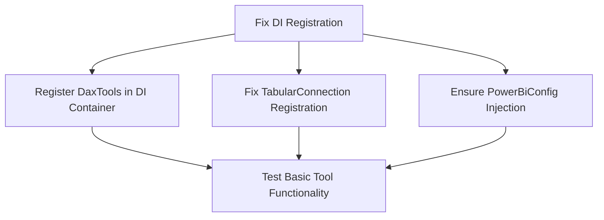

# MCP Tools Error Analysis and Fix Plan

## Problem Summary

After commits `94db3fd` and `96aadd4`, all MCP tools are returning generic errors like "An error occurred invoking 'ListTables'" instead of working properly or providing detailed exception information.

## Root Cause Analysis

### 1. **Missing Dependency Injection Registration**
- [`DaxTools`](../pbi-local-mcp/DaxTools.cs:12) was changed from static to instance-based with constructor DI
- The class requires [`ITabularConnection`](../pbi-local-mcp/Core/ITabularConnection.cs) and [`ILogger<DaxTools>`](../pbi-local-mcp/DaxTools.cs:15) 
- **Issue**: [`DaxTools`](../pbi-local-mcp/DaxTools.cs:12) is not registered in the DI container in [`Server.cs`](../pbi-local-mcp/Resources/Server.cs:55)
- **Result**: MCP framework cannot instantiate the tools class, causing all tool calls to fail

### 2. **Incomplete TabularConnection Registration**
- [`TabularConnection`](../pbi-local-mcp/Resources/TabularConnection.cs:44) expects [`PowerBiConfig`](../pbi-local-mcp/Configuration/PowerBiConfig.cs) in constructor
- **Issue**: DI registration doesn't properly resolve the [`PowerBiConfig`](../pbi-local-mcp/Configuration/PowerBiConfig.cs) dependency
- **Result**: Even if [`DaxTools`](../pbi-local-mcp/DaxTools.cs:12) were registered, [`TabularConnection`](../pbi-local-mcp/Resources/TabularConnection.cs:25) instantiation would fail

### 3. **Custom Exception Serialization Issues**
- New [`DaxQueryExecutionException`](../pbi-local-mcp/Core/DaxQueryExecutionException.cs:10) may not serialize properly through MCP protocol
- **Issue**: Custom exception properties ([`Query`](../pbi-local-mcp/Core/DaxQueryExecutionException.cs:15), [`QueryType`](../pbi-local-mcp/Core/DaxQueryExecutionException.cs:20)) might be lost during serialization
- **Result**: Clients see generic error messages instead of detailed DAX error information

### 4. **Logging Configuration Conflicts**
- Server logs show "Failed to parse message" warnings
- **Issue**: Console logging interferes with MCP JSON protocol communication
- **Result**: Communication issues between MCP client and server

## Implementation Plan

### Phase 1: Fix Dependency Injection (Critical - Restores Basic Functionality)



#### 1.1 Register DaxTools in Server.cs
```csharp
builder.Services
    .Configure<PowerBiConfig>(config => { ... })
    .AddSingleton<ITabularConnection, TabularConnection>()
    .AddSingleton<DaxTools>(); // ADD THIS LINE
```

#### 1.2 Fix TabularConnection DI Registration
```csharp
builder.Services
    .AddSingleton<ITabularConnection>(serviceProvider =>
    {
        var config = serviceProvider.GetRequiredService<IOptions<PowerBiConfig>>().Value;
        var logger = serviceProvider.GetRequiredService<ILogger<TabularConnection>>();
        return new TabularConnection(config, logger);
    });
```

### Phase 2: Fix Exception Handling (Achieves Original Goal)

#### 2.1 Update DaxQueryExecutionException
- Add `[Serializable]` attribute
- Implement serialization constructors for .NET compatibility
- Consider alternative: Use standard `Exception` with enhanced messages

#### 2.2 Test Exception Handling Strategy
- Verify that custom exceptions serialize properly through MCP
- If not, fall back to standard exceptions with detailed messages
- Ensure DAX query errors reach the client with full context

#### 2.3 Alternative Approach (if custom exceptions fail)
```csharp
// Instead of custom exception, enhance standard exception message
catch (AdomdException adomdEx)
{
    var enhancedMessage = $"DAX Query Error: {adomdEx.Message}\n\nQuery: {query}\nQuery Type: {queryType}";
    throw new Exception(enhancedMessage, adomdEx);
}
```

### Phase 3: Fix Logging Configuration

#### 3.1 Separate MCP and Debug Logging
```csharp
builder.Logging.AddConsole(options =>
{
    options.LogToStandardErrorThreshold = LogLevel.Warning; // Only errors to stderr
});
```

#### 3.2 Use Structured Logging
- Log to files instead of console for debug information
- Keep only essential error information in console output
- Ensure MCP JSON protocol is not corrupted by log messages

## Testing Strategy

### Phase 1 Validation
1. **Test Tool Registration**: Verify MCP server starts without DI errors
2. **Test Basic Tool Calls**: Call [`ListTables()`](../pbi-local-mcp/DaxTools.cs:82) and verify it returns data instead of generic errors
3. **Test All Tools**: Verify [`ListMeasures()`](../pbi-local-mcp/DaxTools.cs:32), [`RunQuery()`](../pbi-local-mcp/DaxTools.cs:162), etc. work

### Phase 2 Validation  
1. **Test DAX Error Scenarios**: Execute invalid DAX queries
2. **Verify Error Details**: Confirm clients receive meaningful error messages
3. **Test Exception Properties**: Ensure query text and type are included in errors

### Phase 3 Validation
1. **Check Log Output**: Verify no "Failed to parse message" warnings
2. **Test MCP Communication**: Ensure clean JSON protocol communication
3. **Verify Debug Logging**: Confirm internal logging works without interfering with MCP

## Expected Outcomes

### After Phase 1
- All MCP tools function correctly
- No more "An error occurred invoking 'ListTables'" generic errors
- Basic DAX query execution works

### After Phase 2  
- DAX query errors show detailed information to clients
- Users can see actual DAX syntax errors, semantic errors, etc.
- Enhanced debugging experience for DAX development

### After Phase 3
- Clean MCP protocol communication
- Proper separation of debug logs and error responses
- Improved maintainability and debugging

## Risk Assessment

### Low Risk
- Phase 1 fixes (DI registration) - Standard .NET DI patterns
- Logging configuration changes - Well-documented approaches

### Medium Risk  
- Custom exception serialization - May need fallback to standard exceptions
- MCP tool discovery - Framework-dependent behavior

### Mitigation Strategies
1. **Incremental Testing**: Test each phase independently
2. **Fallback Plans**: Ready to use standard exceptions if custom ones fail
3. **Rollback Strategy**: Can revert to static methods if DI proves problematic

## Questions for Implementation

1. **Exception Strategy**: Prefer custom [`DaxQueryExecutionException`](../pbi-local-mcp/Core/DaxQueryExecutionException.cs:10) or enhanced standard exceptions?
2. **Service Lifetimes**: Keep [`DaxTools`](../pbi-local-mcp/DaxTools.cs:12) as Singleton or use Scoped?
3. **Backward Compatibility**: Any concerns about changing the DI structure?

## Implementation Priority

**High Priority**: Phase 1 (DI fixes) - Required for basic functionality
**Medium Priority**: Phase 2 (Exception handling) - Achieves original enhancement goal  
**Low Priority**: Phase 3 (Logging) - Quality of life improvement

The plan focuses on restoring functionality first, then achieving the enhanced error reporting that was the original goal of the commits.