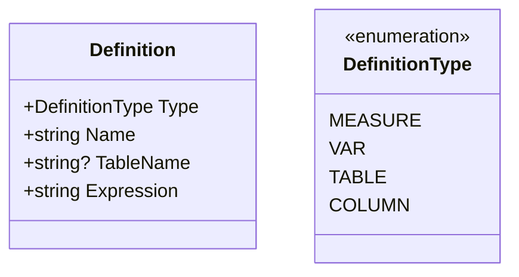
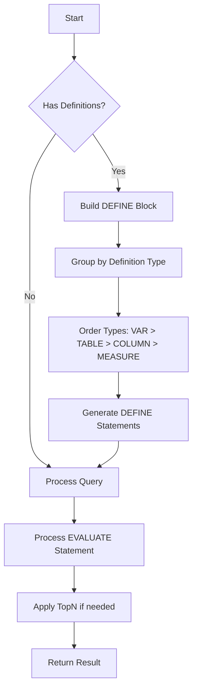

# RunQuery Method Enhancement Design

## Overview
This document outlines the design for enhancing the DaxTools.RunQuery method to support DEFINE block definitions in DAX queries.

## 1. Definition Model



The `Definition` model encapsulates all necessary components for DEFINE block entries:
- `Type`: Enum indicating the type (MEASURE, VAR, etc.)
- `Name`: The name of the definition
- `TableName`: Optional table name for MEASURE and COLUMN types
- `Expression`: The DAX expression for the definition

## 2. Enhanced RunQuery Method Signature

```csharp
[McpServerTool]
[Description("Execute a DAX query with optional DEFINE block definitions")]
public static async Task<object> RunQuery(
    string dax, 
    IEnumerable<Definition>? definitions = null,
    int topN = 10)
```

## 3. Query Construction Logic



## 4. DEFINE Block Rendering Rules

1. Definitions are grouped by type
2. Types are ordered: VAR > TABLE > COLUMN > MEASURE
3. Each definition follows the format:
```
DEFINE
    // Variables first
    VAR _name = <expression>
    // Then tables
    TABLE name = <expression>
    // Then columns
    COLUMN table[name] = <expression>
    // Finally measures
    MEASURE table[name] = <expression>

EVALUATE
    <dax expression>
```

## 5. Example Usage

```csharp
var definitions = new[] {
    new Definition {
        Type = DefinitionType.MEASURE,
        TableName = "Sales",
        Name = "Total Sales",
        Expression = "SUM(Sales[Amount])"
    },
    new Definition {
        Type = DefinitionType.VAR,
        Name = "_fiscalYear",
        Expression = "2024"
    }
};

var result = await RunQuery(
    "EVALUATE SUMMARIZECOLUMNS('Date'[Year], \"Sales\", [Total Sales])",
    definitions,
    10
);
```

Would generate and execute:
```dax
DEFINE
    VAR _fiscalYear = 2024
    MEASURE Sales[Total Sales] = SUM(Sales[Amount])

EVALUATE 
    SUMMARIZECOLUMNS('Date'[Year], "Sales", [Total Sales])
```

## 6. Implementation Considerations

1. Query Processing:
   - Support both simple expressions and complete DAX queries with DEFINE blocks
   - Maintain all existing query processing logic for EVALUATE statements

2. Validation:
   - Validate definition names follow DAX naming rules
   - Ensure TableName is provided for MEASURE and COLUMN types
   - Verify Expression is not null/empty

3. Error Handling:
   - Clear error messages for invalid definitions
   - Proper escaping of names/expressions to prevent injection
   - Validation of the complete generated query